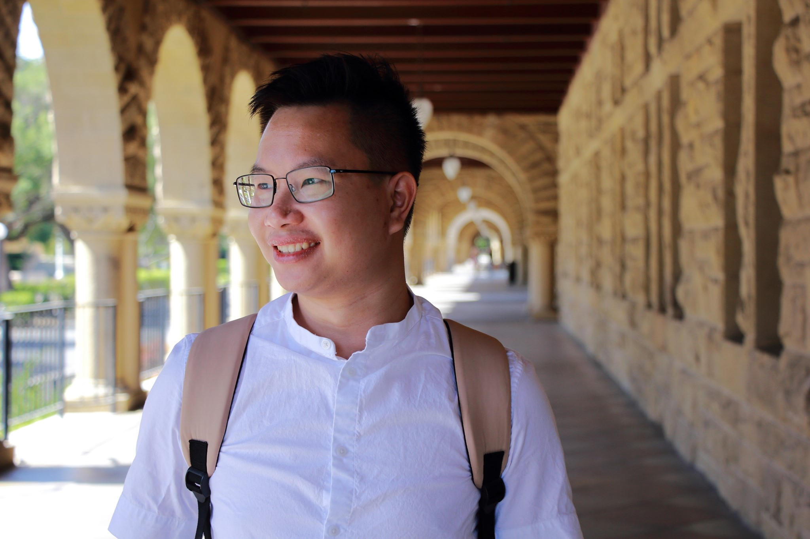

Hi there! My name is Nha Do and I am currently a student in the Department of Electrical and Computer Engineering at UCLA.

I’m interested in Digital Signal Processing, Machine Learning, Deep Learning, Data Analysis and Computer Vision.

My current project is to focus on training End-to-end model using Automatic Speech Recognition (ASR) with Transformer in the Speech Processing and Auditory Perception Laboratory of Professor Abeer Alwan.

In my free time, I enjoy writing and playing sport. I have my personal blog, which has been written mostly in Vietnamese, where I share stories about my career and social life also. I am planning to have English version soon. You can find the link to my blog on the left of this page or check it out [here](https://nhavtdo.wordpress.com/)
