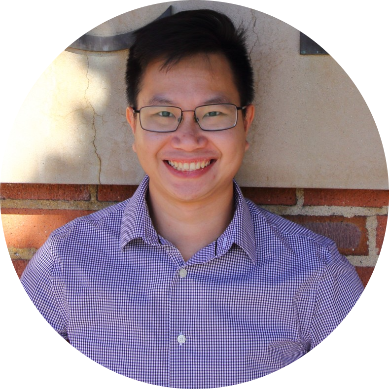

Hi there! My name is Nha Do. I graduated from University of California, Los Angeles (UCLA) with Electrical Engineering major, specializing in Digital Signal Processing, Data Analysis and Applied Machine Learning. Born and raised in Vietnam before moving to Los Angeles. 

I am currently working as a Data Analyst at AT&T in El Segundo, California.

I spent the summer of 2022 with AT&T Labs in Middletown, New Jersey where I worked as a Network and Data Engineer Intern in Big Data team.

In summer 2021, I worked as an Undergraduate Research Assistant at the Speech Processing and Auditory Perception Laboratory under the supervision of Professor Abeer Alwan and mentored by Ph.D student Alexander Johnson, focusing on training and evaluating the End-to-end model using Automatic Speech Recognition (ASR) with Transformer.

In my free time, I enjoy writing and playing sport. I have my personal blog, which has been written mainly by Vietnamese, where I share stories about my career and social life also. I am planning to have English version soon. You can find the link to my blog on the bottom of this page or check it out [here](https://nhavtdo.wordpress.com/).
