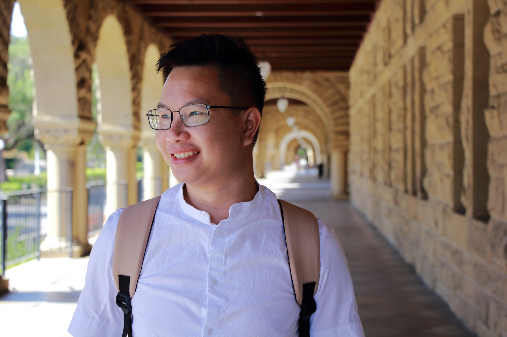

Hi there! My name is Nha Do and I am currently a student in the Department of Electrical and Computer Engineering at UCLA.

I am interested in Digital Signal Processing, Machine Learning, Deep Learning, Data Analysis and their applications in Image Classification and Pattern Recognition.

My current project is to expand the Convolutional Neural Networks (CNN) and deploy it on STM32 Nucleo H7 microntroncoller (which has only 1MB memory constraint) for detecting and classifying given input images into different diseased category.

In summer 2021, I worked as an Undergraduate Research Assistant at the Speech Processing and Auditory Perception Laboratory under the supervision of Professor Abeer Alwan and mentored by Ph.D student Alexander Johnson, focusing on training End-to-end model using Automatic Speech Recognition (ASR) with Transformer.

In my free time, I enjoy writing and playing sport. I have my personal blog, which has been written mostly by Vietnamese, where I share stories about my career and social life also. I am planning to have English version soon. You can find the link to my blog on the bottom of this page or check it out [here](https://nhavtdo.wordpress.com/).
